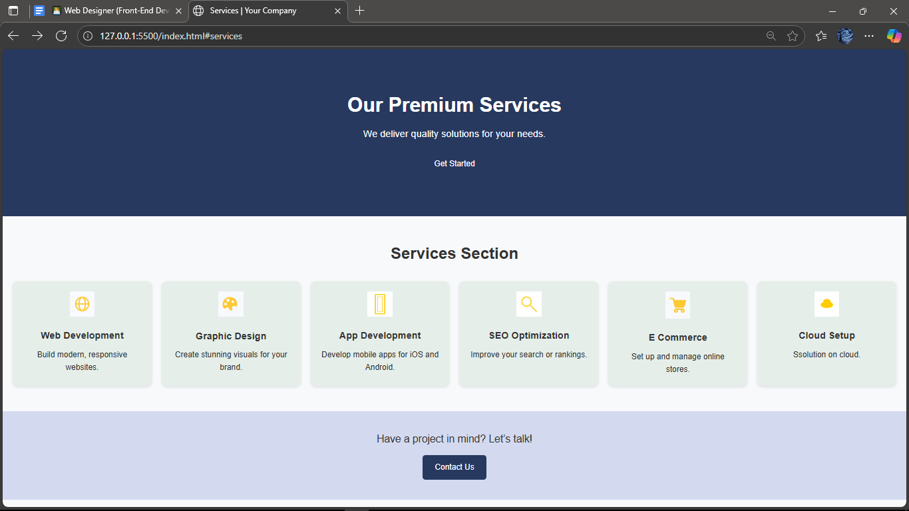

# Responsive-Team-Members-Page
A modern, responsive webpage that displays information about a team.
# Meet Our Team
# 📌 Task Title: Build a Responsive Team Members Page

A modern, responsive "Meet Our Team" section built with **HTML**, **CSS**, and **JavaScript**.  
Features animated team member cards, social links, and an interactive profile modal.

## 🚀 Features
- Responsive grid layout (desktop & mobile)
- Hover animations & smooth transitions
- Click to view full profile in modal
- Social media icons (Font Awesome)
- Google Fonts (Poppins) for modern typography

## 📂 Structure
index.html # Page structure
style.css # Styling & layout
script.js # Modal functionality
images/ # Profile pictures
README.md # Documentation

## ⚙️ Usage
1. Clone or download the project  
   ```bash
   git clone https://github.com/yourusername/meet-our-team.git
Open index.html in a browser.

## 📸 Screenshot


📜 License
MIT License – free to use & modify.
